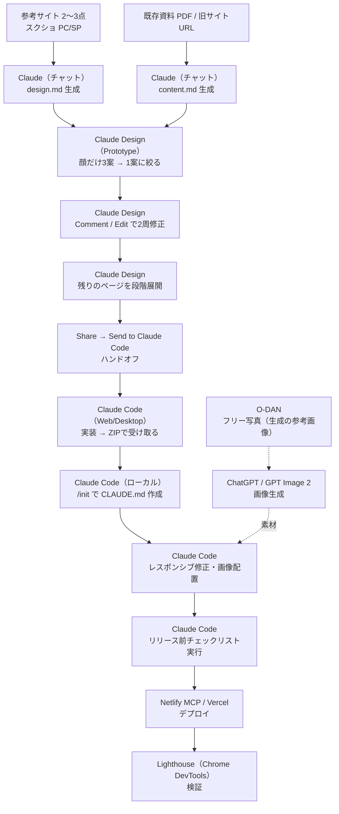

# ツールチェーン — どのAIが何をどう使うか

「作る順番」（SKILL.md）を、**実際のツールに割り当てたもの**。
出典は元動画（AIプログラミングスクールSiiD、2026-07-25）+ 各ツールの一次情報で裏取り済み。

ツールは腐る。**工程の順番は変わらないが、担当ツールは入れ替わる**前提で読むこと。
担当が変わっても、各工程の「入力 / 出力」の契約さえ守れば全体は壊れない。

---

## 全体フロー

---

## 工程ごとの担当

| # | 工程 | 担当 | 入力 | 出力 |
|---|---|---|---|---|
| 0 | 参考採取 | 人間（+ ギャラリーサイト） | — | スクショ PC/SP 各数枚 |
| 1 | `design.md` 生成 | **Claude（通常チャット）** | 参考スクショ + テンプレ | `design.md` |
| 2 | `content.md` 生成 | **Claude（通常チャット）** | 既存PDF / 旧サイトURL + テンプレ | `content.md` |
| 3 | 顔を3案 | **Claude Design（Prototype）** | `design.md` `content.md` + ヒーロー参考3枚 | HTML/CSSの動くプロトタイプ×3 |
| 4 | 修正2周 | **Claude Design**（Comment / Edit） | 箇所指定のフィードバック | 修正版 |
| 5 | 段階展開 | **Claude Design** | 選んだ1案 | 全ページのプロトタイプ |
| 6 | ハンドオフ | **Claude Design → Claude Code** | Share → Send to Claude Code | 実装指示つきセッション |
| 7 | 実装 | **Claude Code（Web / Desktop）** | ハンドオフ束 | コード一式（**ZIPで要求**） |
| 8 | 引き継ぎ | **Claude Code（ローカル）** | `docs/` に置いた md + `/init` | `CLAUDE.md` |
| 9 | 仕上げ | **Claude Code** + Playwright | 箇所指定の修正指示 | レスポンシブ対応・画像配置済み |
| 10 | 画像生成 | **ChatGPT / GPT Image 2** | プロンプト + 参考写真（O-DAN） | 画像素材 |
| 11 | 検査 | **Claude Code** | チェックリストCSV | 実行結果レポート |
| 12 | 公開 | **Netlify MCP**（Levelaは Vercel） | 「MCPでデプロイして」 | 公開URL |
| 13 | 検証 | **Lighthouse**（Chrome DevTools） | 公開URL | Performance / A11y / SEO スコア |

---

## 使うツールの実体

### Claude Design

Anthropic のデザインツール。Pro / Max / Team / Enterprise で使える。
**画像生成器ではなくプロトタイプ生成器**で、出力は動く HTML / CSS / React。
Canva・PDF・PPTX・単体HTMLに書き出せる。

Prototype モードで選べる方向（動画で使っていた3つ）:

| スキル | 効果 |
|---|---|
| **Frontend Design** | 見た目重視。いわゆる「AI臭」を抜く |
| **Interactive Prototype** | 実際に操作できる。JavaScript が入る |
| **Wireframe** | 画面構造を速く作る |

> ⚠ **新しいチャットを開くとスキル選択がリセットされる。** 続きを頼む前に毎回入れ直す。
> 動画でも「めんどくさいんですけど」と言いながら3つ入れ直している。

- [Claude Design 公式](https://claude.com/) / [解説（Qiita）](https://qiita.com/kai_kou/items/e174e7448bc3e2909efe) / [Claude Code連携の強化（SBBIT）](https://www.sbbit.jp/article/cont1/185837)

### Send to Claude Code（ハンドオフ）

Claude Design 右上の **Share → Send to Claude Code**。

- **CLI 派**: 「Copy prompt」でプロンプトをコピーして貼る
- **Desktop / Web アプリ派**: ボタンひとつで、デザインを引き継いだ状態の Claude Code セッションが開く

途中で技術選定を聞かれる（動画では静的サイトなので Plain HTML/CSS を選択）。
画像はプレースホルダーのまま進めるか、実素材を使うかも聞かれる。

> ⚠ **「ZIPでください」と明示しないと成果物を回収できない。**
> クラウド上で完成しただけで終わり、ファイルがどこにあるか分からなくなる。

### Claude Code に入れるプラグイン / MCP

| 名前 | 種類 | 役割 | 入れ方 |
|---|---|---|---|
| **Frontend Design** | Anthropic公式プラグイン | 実装時も「AI臭」を抜く。汎用的な紫グラデ+Inter+白カードへの収束を防ぐ | `/plugin` から検索してインストール |
| **Playwright** | MCP（Microsoft公式） | ブラウザ操作。テスト・デバッグ・実機幅の確認 | `claude mcp add --scope user --transport stdio playwright -- npx -y @playwright/mcp@latest` |
| **Netlify** | MCP（Netlify公式） | デプロイ・ホスティング | `claude mcp add --transport http netlify https://netlify-mcp.netlify.app/mcp` |
| **GSAP** | MCP（サードパーティ） | パララックス・スクロール連動などのリッチ演出 | 実装が複数ある。`gsap-master` 系が最も機能が多い |
| **UI UX Pro Max** | スキル（サードパーティ） | 業種別のUI/UX定石（SaaSならこう、美容サロンならこう） | `/plugin marketplace add nextlevelbuilder/ui-ux-pro-max-skill` → `/plugin install ui-ux-pro-max@ui-ux-pro-max-skill` |

> ⚠ **プラグインを入れたら Claude Code を再起動する。** しないと有効化されない。
> ⚠ スラッシュから始まるコマンドが「認識されないコマンド」と出るときは、`/` を外して
> 文章として投げると CLI 経由で実行してくれる。

- [Frontend Design プラグイン](https://claude.com/plugins/frontend-design) / [中身の解説（Qiita）](https://qiita.com/usk0513/items/38fa991ff5f4f889f186)
- [Netlify MCP 公式](https://github.com/netlify/netlify-mcp) / [Claude Code 用セットアップ](https://docs.netlify.com/build/build-with-ai/agent-setup-guides/set-up-claude-code-for-netlify/)
- [UI UX Pro Max](https://github.com/nextlevelbuilder/ui-ux-pro-max-skill)
- [GSAP MCP（例）](https://github.com/bruzethegreat/gsap-master-mcp-server)
- [Playwright MCP を Claude Code に入れる](https://qiita.com/pixar2867/items/e110682b24e5227ff2ed)

### 画像まわり

| ツール | 役割 |
|---|---|
| **ChatGPT / GPT Image 2** | 画像生成。日本語の文字描画が改善され、1プロンプトで複数枚出る。ChatGPTで最大2K、APIで4K(beta) |
| **O-DAN（オーダン）** | Unsplash・Pexels・Pixabay など海外フリー素材の横断検索。日本語検索対応・商用可。**生成時に添付する参考写真**をここから取る |

生成の要点は2つ。これが抜けると毎回テイストがブレる:

1. **参考画像を必ず添付する**
2. **実写かイラストかを明示する**（人物を入れるなら「非写実的に」を添える）

> ⚠ **Claude Code に一度に添付できる画像は5枚まで。** 大量配置はポチポチやるしかない。

- [GPT Image 2 解説](https://shiftb.dev/articles/gpt-image-2-guide) / [O-DAN](https://o-dan.net/)

### design.md を作る他の手段

自前で参考スクショから起こす以外に、既製品がある。

| 手段 | 特徴 |
|---|---|
| **DESIGN.md ジェネレーター各種** | URLを入れると色・タイポ・スペーシング・CSS変数を抽出。[getdesignmd.net](https://getdesignmd.net/) / [design-extractor.com](https://www.design-extractor.com/) / [designmd.cc](https://designmd.cc/) など。多くは海外サイト向けで、出力が英語＋情報過多になりがち |
| **awesome-design-md-jp** | 日本語サイトのDESIGN.md集。CJKタイポグラフィ（行間・字間）まで含む。2026年7月時点で378サイト分 → [GitHub](https://github.com/kzhrknt/awesome-design-md-jp) |

DESIGN.md は Google Stitch 由来のフォーマットが事実上の標準になりつつある。

### 公開・検証

| ツール | 役割 |
|---|---|
| **Netlify**（動画） | MCPがあるのでClaude Codeから直接デプロイできる。無料プランで足りる。`〇〇.netlify.app` のサブドメインが使える |
| **Vercel**（**Levelaはこちら**） | 既にこのリポジトリが Vercel 前提（`.vercelignore` / `next.config.ts`）。**Levelaの成果物でNetlifyに切り替えない** |
| **Lighthouse** | Chrome DevTools 内蔵。Performance / Accessibility / SEO を測る |
| **Jicoo など（推定）** | 問い合わせフォーム。ダッシュボードで作って埋め込みコードをコピー → Claude Code に投げれば実装できる。無料プランから埋め込み可。※動画の音声が不明瞭で、サービス名は断定できない |

- [Netlify MCP でエージェントがデプロイする](https://www.netlify.com/blog/netlify-mcp-server-ai-agents-deploy-your-code/) / [Jicoo 埋め込み](https://www.jicoo.com/magazine/blog/product-updates-21)

---

## モデルの使い分け

**顔（ファーストビュー / 表紙）にだけ最上位モデルを使い、決まったら落とす。**
ここが一番難しく、一番効く。方向が決まった後の展開作業は機械的なので、上位モデルを使う意味が薄い。

動画の収録時点では Fable と Opus 4.8 を比較して、Fable のグラフィック表現が明確に上だった。
現在の最新は Claude 5 系（Opus 5 / Fable 5 / Sonnet 5）。**上位＝Fable系、標準＝Opus系、量産＝Sonnet系**
という関係だけ覚えておけば、世代が変わっても判断は同じ。

もう1つの要点: **どのモデルでも1発目は良くない。** Fable でも初回は微妙で、
具体的なフィードバックで2周目に大きく改善した。モデルを上げることと修正を回すことは代替関係にない。

---

## 詰まりどころ（先に知っておくもの）

| 症状 | 原因 | 対処 |
|---|---|---|
| 成果物が回収できない | クラウド上で完成しただけ | 「ZIPでください」と明示する |
| プラグインが効かない | 再起動していない | Claude Code を閉じて開き直す |
| Claude Design の出力の質が落ちた | 新チャットでスキル選択がリセット | Frontend Design / Interactive Prototype / Wireframe を入れ直す |
| 続きを頼んだら別物が出てきた | セッションが変わって前提を忘れた | `design.md` / `content.md` を渡し直す。ローカルなら `/init` で `CLAUDE.md` を作る |
| トークン枯渇の警告が出た | 1チャットで作り込みすぎ | 区切りの良いところで新チャットに移る（スキル再設定を忘れずに） |
| 画像がまとめて貼れない | 添付上限5枚 | 分割する。ファイル名で配置先が分かるようにしておくと指示が1回で済む |
| デザインの意図が伝わらない | 一度に大量のスクショを渡した | 「主要面 → 下層 → 別媒体」の3回に分ける |

---

## Levela ではどう読み替えるか

このフローをそのまま使うと、Levelaでは2箇所が噛み合わない。

| 動画 | Levela |
|---|---|
| 工程1で `design.md` を参考サイトから**生成する** | **生成しない。** ブランドは `references/brand.md` で固定済み。`assets/design.md` を埋めるだけ（参考から取るのは構成の引き出しのみ） |
| 技術選定で Plain HTML/CSS | アプリ内の画面は **Next.js App Router + Tailwind v4**。単体のLPや配布物なら静的HTMLでよい |
| Netlify にデプロイ | **Vercel**。Netlify MCP は入れなくてよい |
| リリース前チェックリストCSV | `references/checklist.md` を使う。加えて `npm run lint` と `npm run build`（AGENTS.md の必須手順） |
| 画像生成 → そのまま配置 | 同じ。ただし `hero-main.png` 形式の命名規則（`references/workflow.md`）に従う |

Claude Design を使う場合も、プロンプトの冒頭で
**「配色・書体・角丸・影は `.claude/skills/levela-design/references/brand.md` の確定値に従うこと」**
を明示する。これを言わないと Frontend Design スキルが独自の配色を作りにいく。
